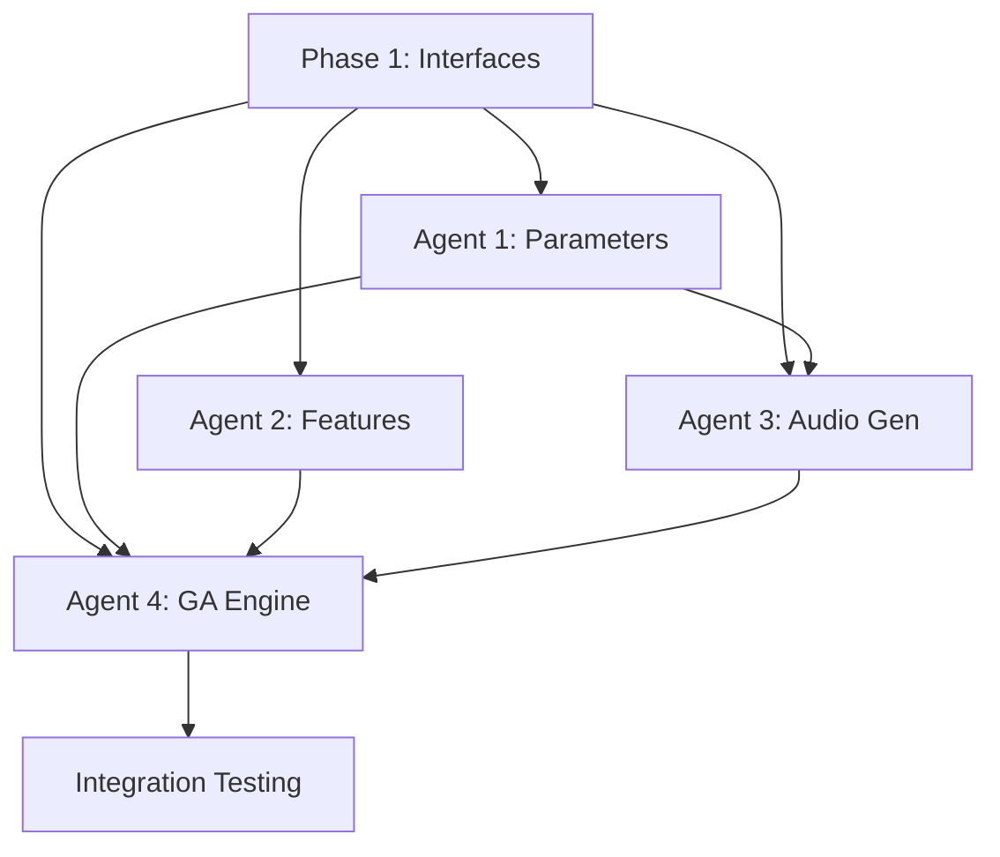

# Multi-Agent SerumEvolver Development Plan

## Phase 1: Interface Definition & Project Setup

### Core Interfaces (Must Complete Before Parallel Development)

#### 1. Data Structures Interface

```python
# serum_evolver/interfaces.py

from typing import Dict, Tuple, List, Optional, Any
from pathlib import Path
from dataclasses import dataclass
import numpy as np

@dataclass
class FeatureWeights:
    """Weighted feature set for multi-feature fitness calculation."""
    # Spectral features
    spectral_centroid: float = 0.0
    spectral_bandwidth: float = 0.0
    spectral_rolloff: float = 0.0
    spectral_contrast: float = 0.0
    spectral_flatness: float = 0.0

    # Temporal features
    zero_crossing_rate: float = 0.0
    rms_energy: float = 0.0

    # Harmonic features
    chroma_mean: float = 0.0
    tonnetz_mean: float = 0.0

    # Cepstral features
    mfcc_mean: float = 0.0

    # Rhythm features
    tempo: float = 0.0

    def get_active_features(self) -> Dict[str, float]:
        """Return only features with non-zero weights."""
        return {k: v for k, v in self.__dict__.items() if v != 0.0}

@dataclass
class ScalarFeatures:
    """Scalar feature values extracted from audio."""
    spectral_centroid: float = 0.0
    spectral_bandwidth: float = 0.0
    spectral_rolloff: float = 0.0
    spectral_contrast: float = 0.0
    spectral_flatness: float = 0.0
    zero_crossing_rate: float = 0.0
    rms_energy: float = 0.0
    chroma_mean: float = 0.0
    tonnetz_mean: float = 0.0
    mfcc_mean: float = 0.0
    tempo: float = 0.0

# Type aliases
SerumParameters = Dict[str, float]  # param_id -> value
ParameterConstraintSet = Dict[str, Tuple[float, float]]  # param_id -> (min, max)
```

#### 2. Parameter Management Interface

```python
# serum_evolver/parameter_manager.py

from abc import ABC, abstractmethod

class ISerumParameterManager(ABC):
    """Interface for Serum parameter management."""

    @abstractmethod
    def load_parameters(self, fx_params_path: Path) -> Dict[str, Dict[str, Any]]:
        """Load parameter definitions from fx_parameters.json."""
        pass

    @abstractmethod
    def validate_parameter_value(self, param_id: str, value: float) -> bool:
        """Validate a parameter value against its defined range."""
        pass

    @abstractmethod
    def get_parameter_bounds(self, param_id: str) -> Tuple[float, float]:
        """Get min/max bounds for a parameter."""
        pass

    @abstractmethod
    def validate_constraint_set(self, constraint_set: ParameterConstraintSet) -> bool:
        """Validate that all constraints are within parameter bounds."""
        pass

    @abstractmethod
    def get_default_parameters(self) -> SerumParameters:
        """Get default parameter values for all Serum parameters."""
        pass
```

#### 3. Feature Extraction Interface

```python
# serum_evolver/feature_extractor.py

class IFeatureExtractor(ABC):
    """Interface for audio feature extraction."""

    @abstractmethod
    def extract_scalar_features(self, audio_path: Path,
                              feature_weights: FeatureWeights) -> ScalarFeatures:
        """Extract scalar features from audio file."""
        pass

    @abstractmethod
    def compute_feature_distance(self, target_features: ScalarFeatures,
                               actual_features: ScalarFeatures,
                               feature_weights: FeatureWeights) -> float:
        """Compute weighted distance between feature sets."""
        pass
```

#### 4. Audio Generation Interface

```python
# serum_evolver/audio_generator.py

class IAudioGenerator(ABC):
    """Interface for audio generation from Serum parameters."""

    @abstractmethod
    def create_random_patch(self, constraint_set: ParameterConstraintSet) -> Tuple[SerumParameters, Path]:
        """Generate random patch within constraints and render audio."""
        pass

    @abstractmethod
    def render_patch(self, serum_params: SerumParameters,
                    session_name: str) -> Path:
        """Render specific Serum parameters to audio file."""
        pass
```

#### 5. GA Problem Interface

```python
# serum_evolver/ga_engine.py

class ISerumEvolver(ABC):
    """Interface for Serum evolutionary optimization."""

    @abstractmethod
    def evolve(self, constraint_set: ParameterConstraintSet,
              target_features: ScalarFeatures,
              feature_weights: FeatureWeights,
              n_generations: int = 10,
              population_size: int = 8) -> Dict[str, Any]:
        """Run evolutionary optimization."""
        pass
```

---

## Phase 2: Parallel Agent Development

### Agent 1: Parameter Management System
**Files:** `parameter_manager.py`, `tests/test_parameter_manager.py`

**Tasks:**
- [ ] Implement `SerumParameterManager` class
- [ ] Load and parse `fx_parameters.json` (2400 parameters)
- [ ] Parameter validation against JSON bounds
- [ ] Constraint set validation logic
- [ ] Default parameter value management
- [ ] Unit tests for all validation logic

**Key Implementation:**
```python
class SerumParameterManager(ISerumParameterManager):
    def __init__(self, fx_params_path: Path):
        self.params = self._load_parameters(fx_params_path)
        self.param_lookup = self._build_lookup()

    def validate_parameter_value(self, param_id: str, value: float) -> bool:
        param = self.params.get(param_id)
        if not param:
            return False
        return param['min_value'] <= value <= param['max_value']
```

### Agent 2: Librosa Feature Extraction
**Files:** `feature_extractor.py`, `tests/test_feature_extractor.py`

**Tasks:**
- [ ] Implement `LibrosaFeatureExtractor` class
- [ ] Extract scalar values from librosa features:
  - Spectral: mean of spectral_centroid, spectral_bandwidth, spectral_rolloff, spectral_contrast, spectral_flatness
  - Temporal: mean zero_crossing_rate, mean RMS energy
  - Harmonic: mean chroma energy, mean tonnetz
  - Cepstral: mean of first MFCC coefficient
  - Rhythm: tempo estimation
- [ ] Implement weighted distance calculation
- [ ] Audio loading and preprocessing
- [ ] Unit tests for feature extraction accuracy

**Key Implementation:**
```python
class LibrosaFeatureExtractor(IFeatureExtractor):
    def extract_scalar_features(self, audio_path: Path,
                              feature_weights: FeatureWeights) -> ScalarFeatures:
        y, sr = librosa.load(str(audio_path), sr=44100, mono=True)

        features = ScalarFeatures()

        # Only compute features with non-zero weights
        active_features = feature_weights.get_active_features()

        if 'spectral_centroid' in active_features:
            centroid = librosa.feature.spectral_centroid(y=y, sr=sr)
            features.spectral_centroid = np.mean(centroid)

        # ... implement all other features

        return features
```

### Agent 3: Audio Generation System
**Files:** `audio_generator.py`, `tests/test_audio_generator.py`

**Tasks:**
- [ ] Implement `SerumAudioGenerator` class
- [ ] Random parameter generation within constraints
- [ ] Integration with existing REAPER workflow
- [ ] Standardized audio rendering (Middle C, 148 BPM, whole note)
- [ ] Audio file management and cleanup
- [ ] Unit tests for parameter generation and audio rendering

**Key Implementation:**
```python
class SerumAudioGenerator(IAudioGenerator):
    def __init__(self, reaper_project_path: Path, param_manager: ISerumParameterManager):
        self.reaper_executor = ReaperExecutor(reaper_project_path)
        self.param_manager = param_manager

    def create_random_patch(self, constraint_set: ParameterConstraintSet) -> Tuple[SerumParameters, Path]:
        # Generate random values within constraint ranges
        serum_params = self._generate_random_parameters(constraint_set)

        # Get default values for unconstrained parameters
        full_params = self.param_manager.get_default_parameters()
        full_params.update(serum_params)

        # Render through REAPER
        audio_path = self.render_patch(full_params, f"random_{uuid.uuid4()}")

        return serum_params, audio_path
```

### Agent 4: Adaptive GA Engine
**Files:** `ga_engine.py`, `tests/test_ga_engine.py`

**Tasks:**
- [ ] Implement `AdaptiveSerumProblem` class extending pymoo Problem
- [ ] Adaptive genome sizing based on constraint set
- [ ] Parameter ID to genome index mapping
- [ ] Fitness evaluation using feature distance
- [ ] Integration with JSI ranking system
- [ ] Population evaluation and selection
- [ ] Unit tests for genome conversion and fitness calculation

**Key Implementation:**
```python
class AdaptiveSerumProblem(Problem):
    def __init__(self, constraint_set: ParameterConstraintSet,
                 target_features: ScalarFeatures,
                 feature_weights: FeatureWeights,
                 audio_generator: IAudioGenerator,
                 feature_extractor: IFeatureExtractor):

        # Adaptive genome size
        self.param_ids = list(constraint_set.keys())
        n_var = len(self.param_ids)

        # Extract bounds from constraint set
        bounds = list(constraint_set.values())
        xl = np.array([b[0] for b in bounds])
        xu = np.array([b[1] for b in bounds])

        super().__init__(n_var=n_var, n_obj=1, xl=xl, xu=xu)

    def _evaluate(self, x, out):
        # Convert genome to parameter dict
        # Generate audio for each individual
        # Extract features and compute fitness
        pass
```

### Agent 5: Unit Testing
**Files:** `tests/test_*.py`

**Tasks:**
- [ ] Test parameter loading and validation
- [ ] Test feature extraction with known audio samples
- [ ] Test random parameter generation
- [ ] Test genome to parameter conversion
- [ ] Test fitness calculation
- [ ] Mock REAPER integration for testing
- [ ] Test data fixtures and utilities

---

## Phase 3: Integration & Testing

### Integration Points
1. **Parameter Manager ↔ Audio Generator**: Constraint validation and default values
2. **Audio Generator ↔ GA Engine**: Random patch generation and rendering
3. **Feature Extractor ↔ GA Engine**: Feature extraction and distance calculation
4. **All Components ↔ REAPER**: Audio rendering workflow

### Success Criteria
- Generate 8-individual populations with adaptive genome size
- Extract scalar features from rendered audio
- Calculate weighted fitness using feature distances
- Complete evolution cycle in <60 seconds
- 100% parameter validation accuracy
- Successful integration with existing REAPER workflow

---

## Development Dependencies



This plan ensures clear contracts between components while enabling true parallel development across agents.
